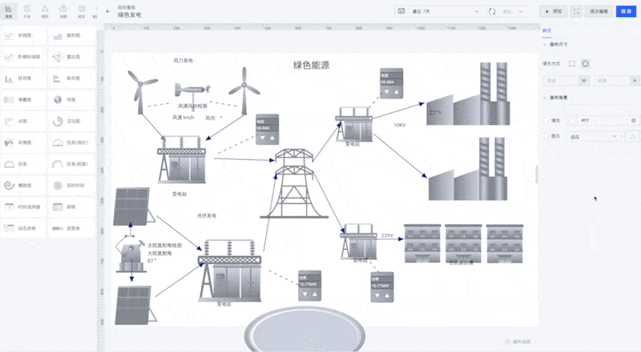
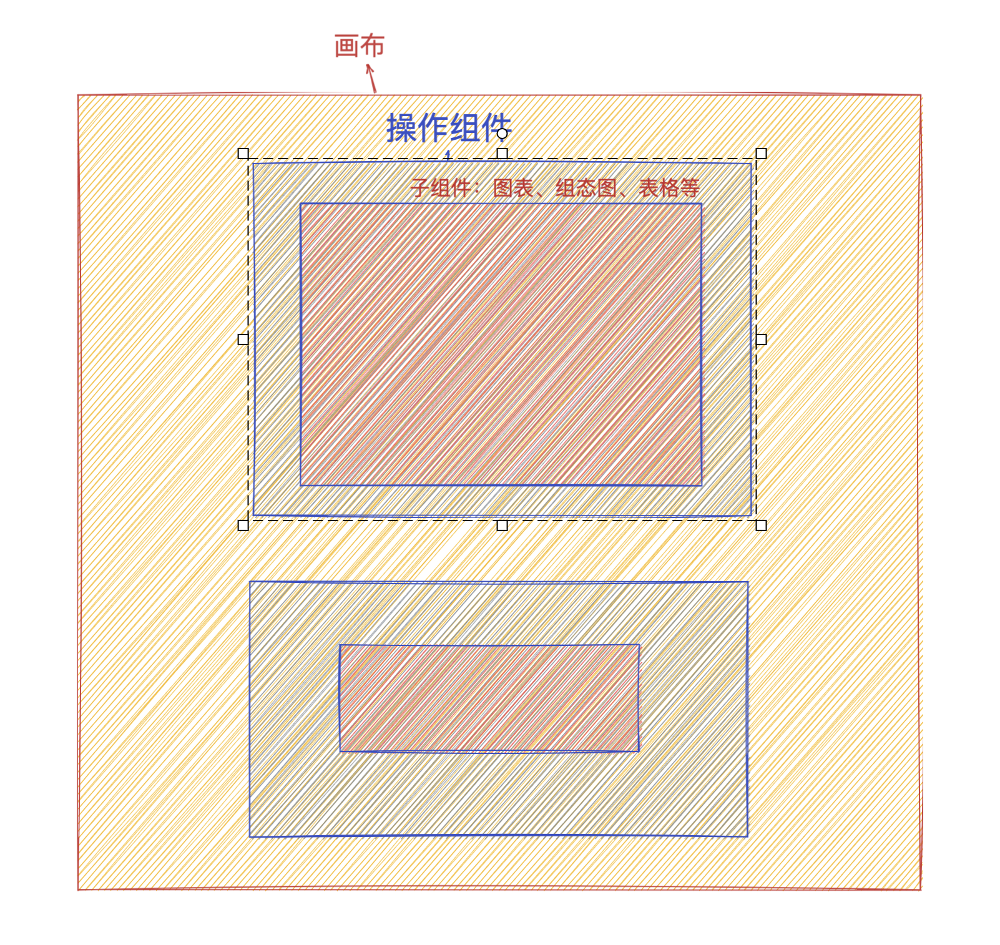

# Vue 3 + TypeScript + Vite + Pinia

项目起源于之前的一个公司低代码数据可视化项目， 后来打算看一下 vue3 的时候发现没什么适合的练手项目，所以就把之前的低代码项目使用 `vue3` 改写一个低配版本出来

整体使用 `ts` + `vue3` + `vue-router` + `pinia`

因为个人项目比较清楚知道自己在写什么，所以没有使用 `eslint`，简单使用 `prettier` 做一些格式化需求即可

### 原理示意图

本身设计思路比较简单，因为涉及 `dom` 元素比较多，所以无法使用现成的一些 `canvas` 库比如 `konva`，只能使用 div 去模拟画布。之前也尝试过依旧使用 `canvas`，下面
再加一层用来放置 `dom`，但是会导致 `dom` 操作比较困难，尤其是很多设计复杂操作的表格等，使用事件代理也很难比较好的处理这部分操作，所以还是使用 `div` 来做模拟，但是使用 `div` 模拟可能
会导致一些绘制操作，比如线条，曲线比较难以实现，好在大多数平台并不需要一个非常自由的画板，这个取舍还是比较值得的。

整体分为三部分，分别是画布、操作组件、内容组件，简单讲一下各个部分是做什么的，详细设计参考 component 文件夹内的各个组件 readme

##### 画布
画布是承载一些的基座，这部分主要是后续用来实际使用的展示窗口，在编辑界面的时候可以超出画布实现一个无限画布的效果，但是预览的时候超出部分会直接裁切隐藏，画布本身支持一些背景颜色、图片以及尺寸的修改、

##### 操作组件
操作组件是一个通用组件，也是实现 `low code` 拖拉拽的核心部分，这部分使得我们的组件拥有了自由拖拽、移动、缩放、旋转的能力，也是实现最为困难的部分，需要比较麻烦的 `dom` 操作加上一部分数学运算来完成。
目前预计支持的功能
* 拖拽移动
* 缩放
* 等比缩放
* 旋转
* 锁定方向移动
* 快捷复制
* 设置层级

##### 内容组件
内容组件作为实际我们需要显示的内容的填充物，实现是比较简单的，整体比较易于扩展，只需要最后把他渲染到操作组件内部即可，这样设计会使得整体自由度比较高，支持任意形式的 `dom` 组件填充为内容组件。

### 目录结构
 - src 项目主要代码
   - assets 主要存放图片等资源 
   - components 存放组件
   - pages 存放页面文件
   - route 存放路由
   - stores 存放状态仓库
   - hooks 存放一些可能会通用的 hooks

### 启动项目
yarn run dev 开发
yarn run build 打包